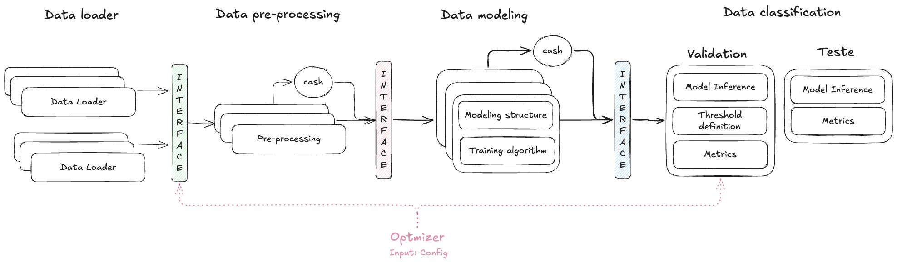

# TrailKeeper

*A modular framework for ML experimentation and experiment tracking*

## Overview

TrailKeeper is a framework designed to **structure, track, and reproduce machine learning experiments**.
It provides a clean architecture inspired by **SOLID principles**, enabling modularity, extensibility, and reproducibility across the full ML workflow.

The framework helps researchers and practitioners to:

* Organize experiments in a reproducible way
* Configure pipelines with ease (YAML configs)
* Track metrics, logs, and artifacts
* Integrate with experiment tracking tools (Weights & Biases, etc.)
* Compare and visualize results

---

## Features

* **Config-driven workflows**: Define experiments using YAML configs
* **Modular data loaders**: Easily swap datasets (e.g., MNIST, custom datasets)
* **Preprocessing components**: Standard normalization, transformations
* **Flexible modeling**: Training, inference, and structure separation
* **Optimizer integration**: Support for custom optimizers & Optuna for hyperparameter search
* **Metrics factory**: Plug-and-play metrics for evaluation
* **Logging and tracking**: Base logger + W&B tracker for experiment visualization
* **Reproducibility**: Save runs, metrics, predictions, and configs

---

## Project Structure

```
configs/           # YAML configs for experiments
data/              # Datasets
data_loader/       # Data loaders (e.g. MNISTLoader)
data_pre_processing/ # Preprocessing modules
logger/            # Logging utilities
metrics/           # Evaluation metrics
modeling/          # Model structure, training, inference
optimizer/         # Base + Optuna optimizers
runs/              # Saved experiment runs
tracker/           # Experiment tracking (base + W&B)
utils/             # Helpers (config, device, IO, etc.)
```

---

## Design Principles

TrailKeeper is inspired by **SOLID design principles**:

* **S**ingle Responsibility → Clear separation of concerns
* **O**pen/Closed → Easy to extend with new components
* **L**iskov Substitution → Interchangeable modules
* **I**nterface Segregation → Minimal, focused interfaces
* **D**ependency Inversion → Flexible architecture

---

## Workflow Pattern

TrailKeeper organizes experiments following a **pattern** that structures the ML experimentation e into modular, traceable components.

The diagram below illustrates the pattern:



Each block of the workflow maps directly to components in the codebase:

### 1. Data Loader

* **Purpose**: Load raw datasets into the pipeline.
* **Code**: `data_loader/`
* **Examples**: `MNISTLoader`, `CustomLoader`.
* **Pattern Link**: Multiple loaders can be swapped in without changing the rest of the pipeline.

---

### 2. Data Pre-processing

* **Purpose**: Clean, transform, and prepare data before training.
* **Code**: `data_pre_processing/`
* **Examples**: normalization, augmentation, feature selection.
* **Pattern Link**: Supports caching so repeated runs don’t redo preprocessing unnecessarily.

---

### 3. Data Modeling

* **Purpose**: Define model structure and training algorithm.
* **Code**: `modeling/`

  * `structure/` → Model definitions (MLP, CNN, etc.)
  * `training/` → Training logic and loop.
* **Pattern Link**: Separation of structure and training improves modularity.

---

### 4. Validation

* **Purpose**: Run inference on validation data, define thresholds, compute metrics.
* **Code**:

  * `metrics/` → Evaluation functions (accuracy, F1, etc.)
  * `modeling/inference.py` → Inference utilities.
* **Pattern Link**: Validation provides feedback for optimizer and config tuning.

---

### 5. Test

* **Purpose**: Final evaluation on held-out test data.
* **Code**:

  * `metrics/`
  * `modeling/inference.py`
* **Pattern Link**: Produces final metrics for comparison and reproducibility.

---

### 6. Optimizer

* **Purpose**: Automate hyperparameter tuning and experiment search.
* **Code**: `optimizer/` (supports Optuna and custom optimizers).
* **Pattern Link**: Feeds configs into the workflow and integrates results from validation.

---

### 7. Tracking & Artifacts

* **Purpose**: Store and track all results for reproducibility.
* **Code**:

  * `logger/` → Local logging utilities.
  * `tracker/` → Integrations with W&B.
  * `runs/` → Saved configs, logs, metrics, predictions, model weights.
* **Pattern Link**: Guarantees traceability across experiments.

---

### Key Idea

This pattern makes the workflow:

* **Modular** → Swap datasets, models, or metrics easily.
* **Traceable** → Logs, configs, and artifacts track every run.
* **Reproducible** → Any run can be reproduced from its saved config and artifacts.

---

## Getting Started

### 1. Installation

Clone the repository:

```bash
git clone https://github.com/MauricioSight/TrailKeeper.git
cd TrailKeeper
```

Create and activate a local virtual environment:

```bash
# Create virtual environment
python -m venv .venv

# Activate it
# On Linux/Mac
source .venv/bin/activate
# On Windows (PowerShell)
.venv\Scripts\activate
```

Install dependencies:

```bash
pip install -r requirements.txt
```

### 2. Running an Experiment

```bash
python execute_train_validation.py --config <config_file (i.e. mlp)>
```

### 3. Running Hyperparameter Tuning

```bash
python execute_tunning.py --config <config_file (i.e. mlp)>
```

### 4. Evaluating Results

```bash
python execute_get_metrics.py --run_id <run_id>
```

---

## Experiment Tracking

TrailKeeper integrates with **Weights & Biases** [W&B](https://github.com/MauricioSight/TrailKeeper) for experiment logging and visualization:

* Track metrics in real-time
* Compare experiments
* Reproduce runs with saved configs and logs

---

## Contributing

Contributions are welcome! Please open issues or PRs to suggest improvements.

